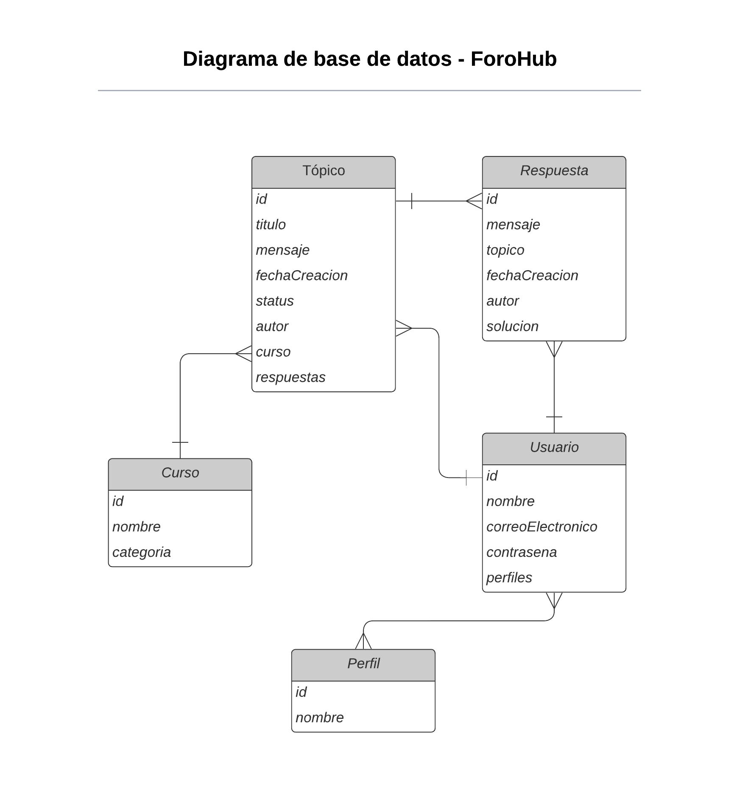

# Forohub
<p align="left">
   
   </p>
Forohub es una aplicación de foro diseñada para practicar habilidades de desarrollo backend utilizando Spring Boot, MySQL, y Swagger para la documentación de la API REST.

## Tabla de Contenidos

- [Descripción](#descripción)
- [Características](#características)
- [Tecnologías Utilizadas](#tecnologías_utilizadas)
- [Instalación](#instalación)
- [Configuración](#configuración)
- [Ejecución](#ejecución)
- [Uso](#uso)
- [Documentación de la API](#documentación-de-la-api)
- [Contribuciones](#contribuciones)
- [Autor](#autor)
- [Conclusión](#conclusión)

## :hammer:Descripción

Forohub es una plataforma de foro donde los usuarios pueden crear, leer, actualizar y eliminar tópicos. Esta aplicación está desarrollada con Spring Boot y se conecta a una base de datos MySQL. La API REST está documentada utilizando Swagger.

## Características

- Crear, leer, actualizar y eliminar tópicos.
- Conexión a una base de datos MySQL.
- API REST.
- Documentación de la API con Swagger.

## Tecnologías Utilizadas

- Java 17 o superior
- Framework Spring: Spring Boot, Spring JPA, Spring Security, Spring Web
- Swagger
- Maven 3.6.0 o superior
- MySQL 8.0 o superior
- Insomnia

## Instalación

1. Clona el repositorio:
    ```sh
    git clone https://github.com/tu-usuario/forohub.git
    cd forohub
    ```

2. Compila el proyecto en desde cli:
    ```
    javac -d bin src/com.alura.waldir.demo/*.java
    ```

## Configuración

1. Crea una base de datos en MySQL:
    ```sql
    CREATE DATABASE forohub_db;
    ```

2. Configura las credenciales de la base de datos en `src/main/resources/application.properties`:
    ```properties
    spring.datasource.url=jdbc:mysql://localhost:3306/forohub_db
    spring.datasource.username=tu_usuario
    spring.datasource.password=tu_contraseña
    spring.datasource.driver-class-name=com.mysql.cj.jdbc.Driver
    spring.jpa.hibernate.ddl-auto=update
    spring.jpa.show-sql=true
    ```

## Ejecución

1. Ejecuta la aplicación con Maven:
    ```
    java -cp bin com.alura.waldir.demo.Main
    ```

2. La aplicación estará disponible en `http://localhost:8080`.

## Uso

### Endpoints de la API

- **Crear un Tópico:**
    ```sh
    POST /topicos
    ```
    ```json
    {
        "titulo": "Introducción a Spring",
        "mensaje": "Aprende los conceptos básicos de Spring Framework",
        "autor": "Jhon rojas",
        "curso": "Java"
    }
    ```

- **Obtener todos los Tópicos:**
    ```sh
    GET /topicos
    ```

- **Actualizar un Tópico:**
    ```sh
    PUT /topicos/{id}
    ```
    ```json
    {
        "titulo": "Introducción a Spring Boot",
        "mensaje": "Aprende a crear aplicaciones con Spring Boot",
        "curso": "Java"
    }
    ```

- **Eliminar un Tópico:**
    ```sh
    DELETE /topicos/{id}
    ```

## Documentación de la API

La documentación de la API está disponible en Swagger. Una vez que la aplicación esté en ejecución, puedes acceder a la documentación en: 
http://localhost:8080/swagger-ui.html


## Contribuciones

¡Las contribuciones son bienvenidas! El proyecto necesita un Front End.

## Autor

<i>Waldir Límaco</i>

## Conclusión
El proyecto ForoHub ha abarcado muchos aspectos y funcionalidades de spring, ha sido un tanto complejo pero muy enriquecedor y satisfactorio el proceso,
falta completar varias funcionalidades e implementar otras rutas. Les el diagrama de la BD.

